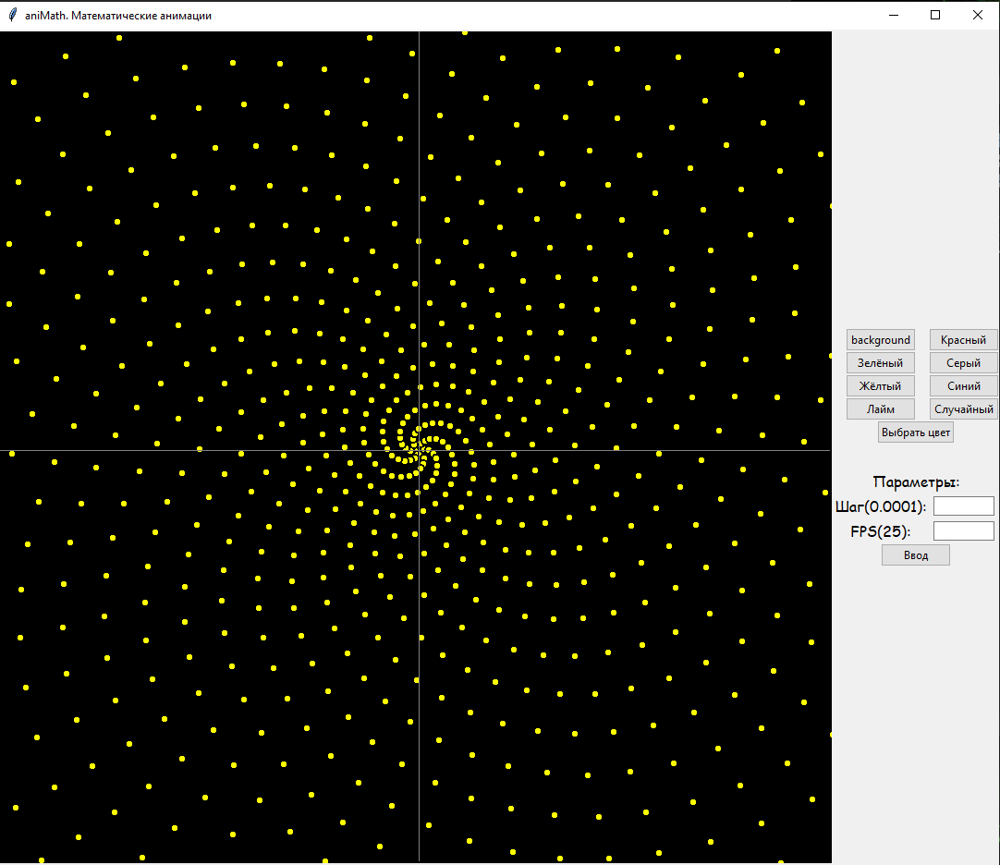
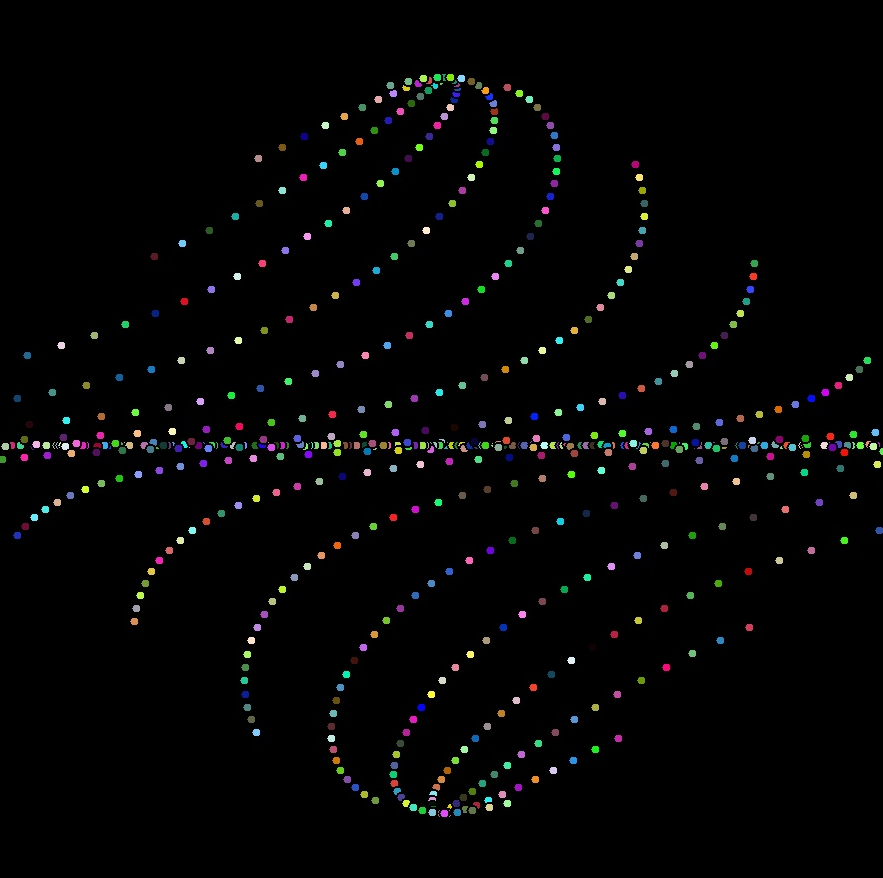
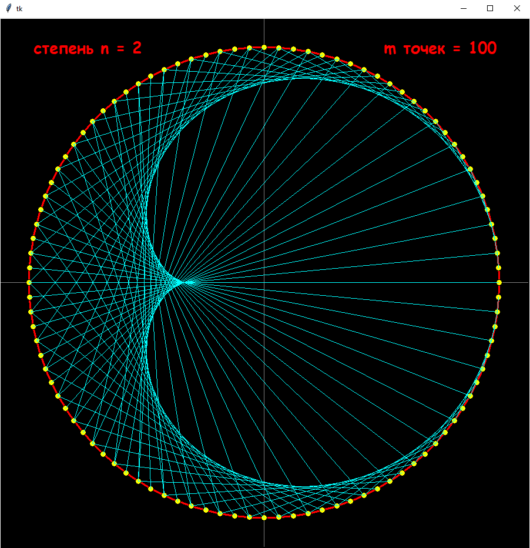
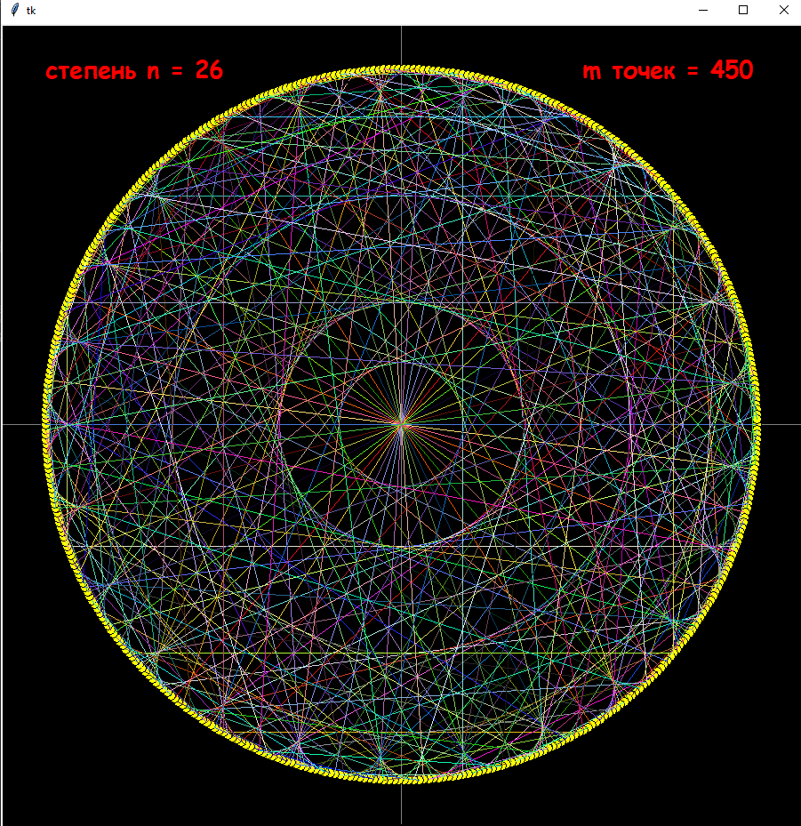
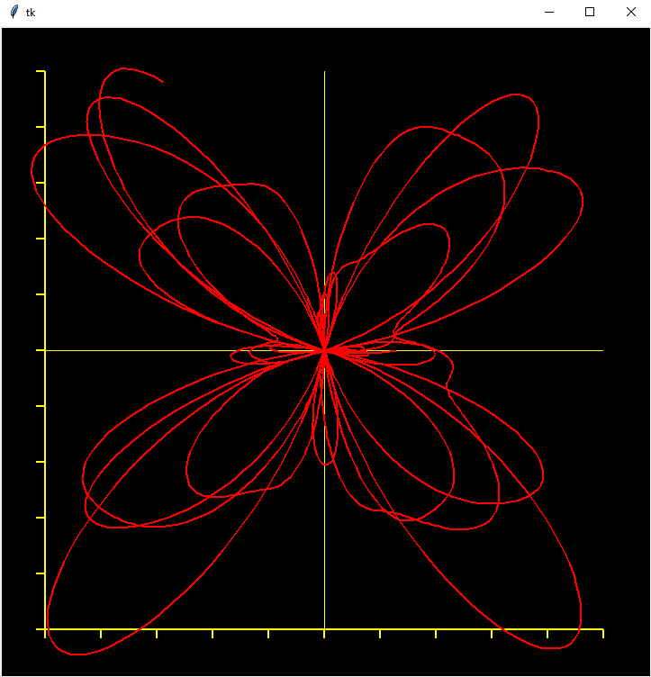
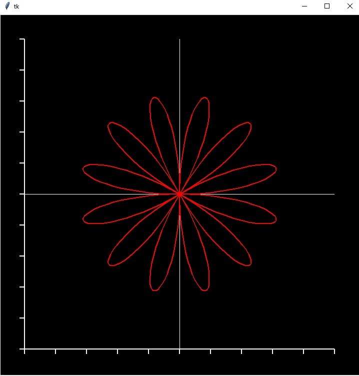
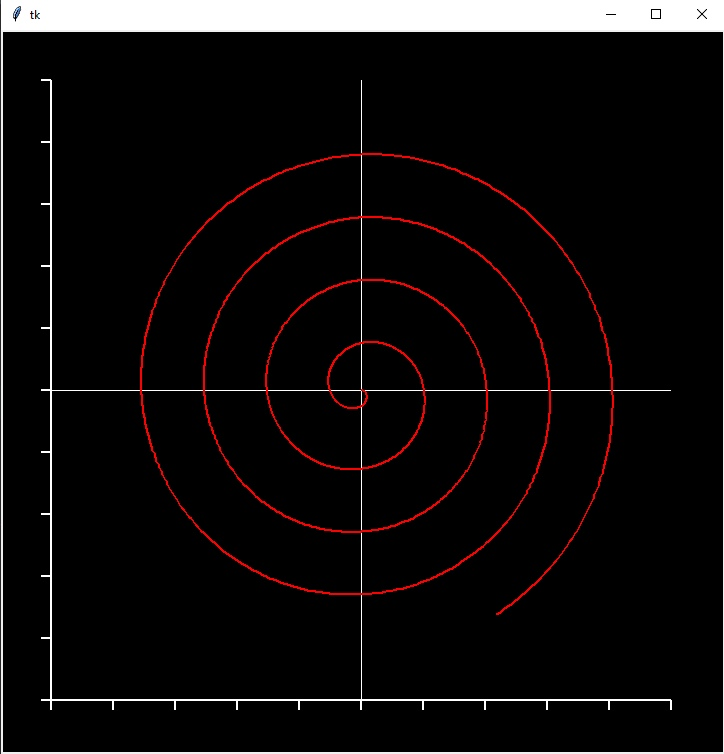
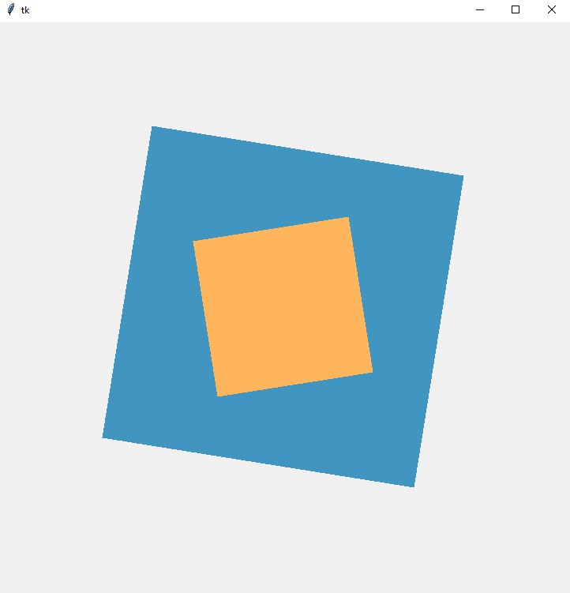

# MathEDU
Математическое образование. Исследование математических явлений. Математические анимации.

Mathematical education. Study of mathematical phenomena. Mathematical animations.

*Примечание: данный репозиторий является публичным и может быть использован в образовательных целях.
             Python можно скачать тут: https://www.python.org/downloads/
             

# Рекомендуется к рассмотрению:
1. https://github.com/simensgreen/BarnsleysFern - построение папоротника Барнсли и изменение его параметров.
2. https://github.com/Battle-Of-Two-K/Buffon-s-Noodle-Problem - проблема иглы Бюффона.
3. https://github.com/Battle-Of-Two-K/Calculating-Pi-by-Monte-Carlo-Method - вычисление числа пи методом Монте-Карло.

# Наглядно о том, как должны работать программы, представленные в данном репозитории:
https://drive.google.com/file/d/1Vx1ddEKaxtmSxCiiqnOfGAvEub6njABt/view?usp=sharing

# Что вас ждёт:

